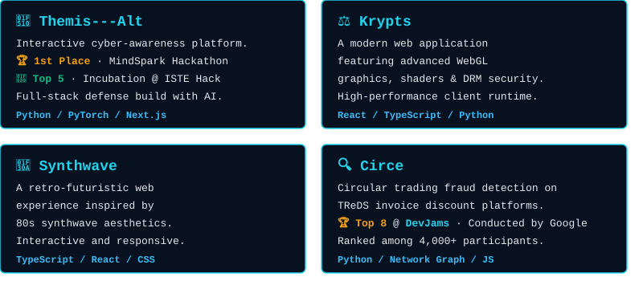

<!-- Generated by GitHub Profile Agent Console. Edit profile.config.json, then run npm run generate. -->

  

  <picture>
    <source media="(max-width: 760px) and (prefers-color-scheme: dark)" srcset="./assets/hero/agent-console-29400060-mobile-dark.svg">
    <source media="(max-width: 760px)" srcset="./assets/hero/agent-console-29400060-mobile-light.svg">
    <source media="(prefers-color-scheme: dark)" srcset="./assets/hero/agent-console-29400060-dark.svg">
    <source media="(prefers-color-scheme: light)" srcset="./assets/hero/agent-console-29400060-light.svg">
    
  </picture>

  
  
  

  

  

    
    
  

  

  

  

  

  
  
  
  
  
  

  

  
  
  
  
  
  
  

